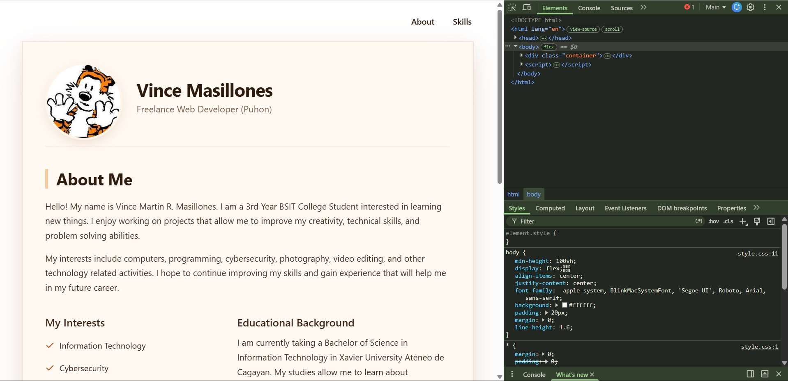
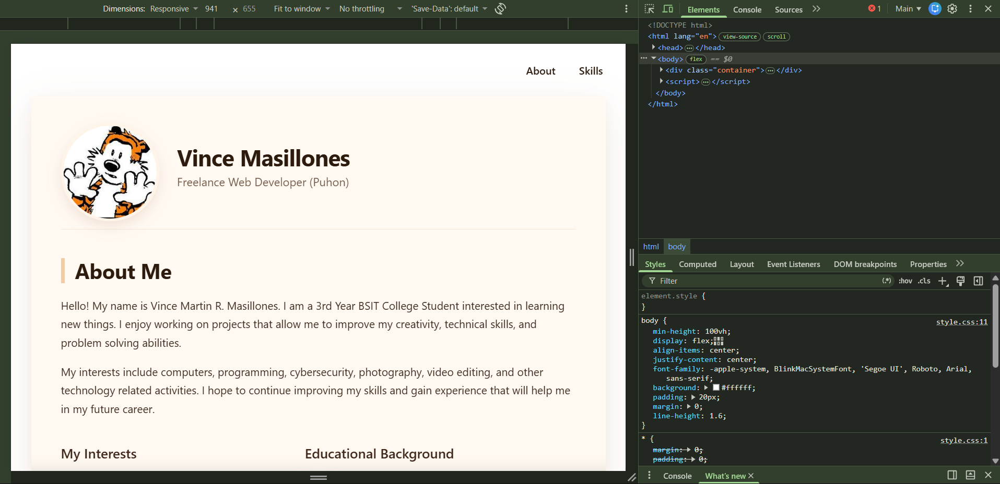
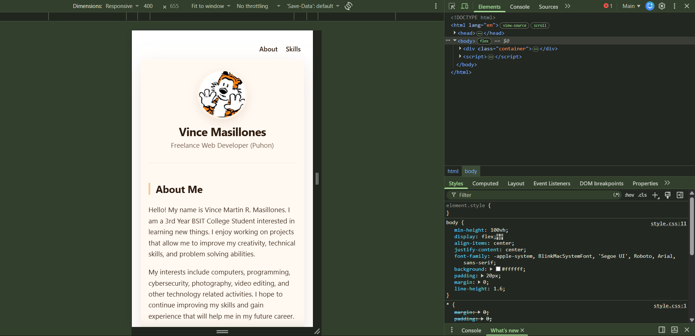

Masillones_StudentProfile

Overview

Personal student profile page that shows my information, interests, skills, and educational background. Fully responsive and works on desktop, tablet, and mobile devices.

Project Info

- Course: ITCC 41 — Mobile Application Development
- Activity: Module 3 — Student Profile Activity (Improved)
- Student: Vince Martin R. Masillones
- Tech Stack:** HTML5, CSS3, JavaScript, Cordova (Android platform)

Features

- Responsive design (Desktop, Tablet, Mobile)
- Profile picture with hover effect
- Smooth scrolling navigation
- "Back to Top" button
- Accessible design with ARIA labels
- Clean and minimal design

Technologies Used

- HTML5
- CSS3 (Flexbox, Grid, Media Queries)
- JavaScript

Screenshots

### Desktop View

### Tablet View

### Mobile View

Project Structure
├── www/
│ ├── index.html # Main HTML file
│ ├── style.css # CSS styles
│ ├── profile.jpg # Profile photo
│ └── profile-hover.jpg # Hover photo
├── platforms/ # Cordova platforms
│ └── android/
├── screenshots/ # Screenshots for README
│ ├── desktop.png
│ ├── tablet.png
│ └── mobile.png
├── config.xml # Cordova configuration
└── package.json # Node.js dependencies

## 🚀 How to View

1. Clone the repository
2. Open `index.html` in your browser
3. Or visit the live demo: [Your GitHub Pages URL]

## 📝 What I Learned

- Creating responsive layouts with media queries
- Implementing accessibility features
- Using semantic HTML elements
- Working with CSS transitions and hover effects
- Adding smooth scrolling with JavaScript

## 📅 Activity Details

**Course:** ITCC 41 - Mobile Application Development  
**Module:** Module 3 - Student Profile Activity  
**Deadline:** September 2, 11:59 PM

## 📄 License

This project is for educational purposes only.

---

Created by Vince Martin R. Masillones