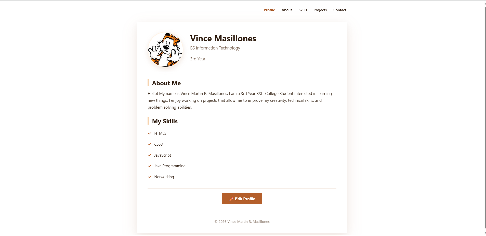
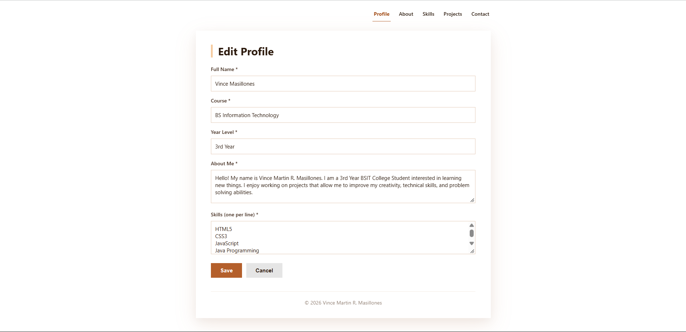
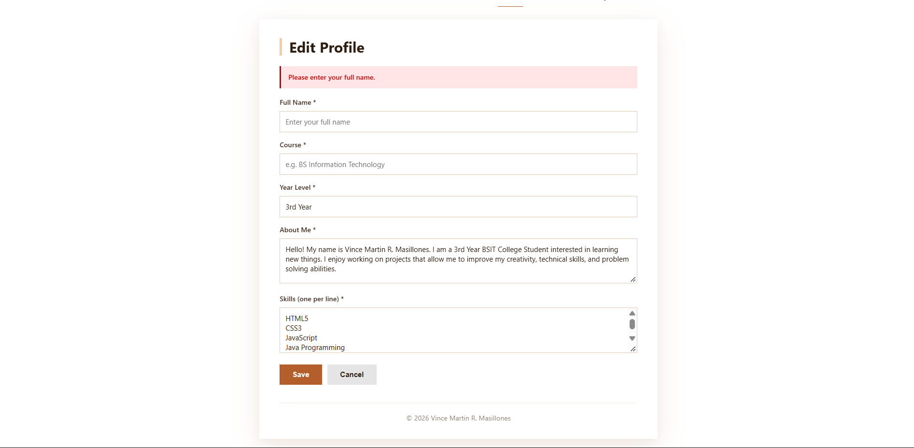
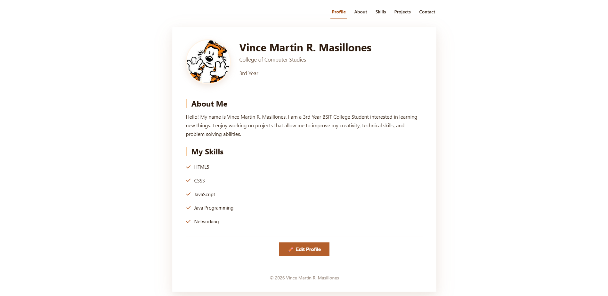

# Masillones_StudentProfile

A responsive **multi-page** Student Profile application with **editable profile data** built with HTML5, CSS3, JavaScript, and Apache Cordova.

## Project Description

This application expands the previous multi-page Student Profile into an interactive app with a working **Edit Profile** feature. Profile data (name, course, year level, about, skills) can be edited by the user, validated with JavaScript, and saved to `localStorage` so changes persist even after closing the app.

## Application Pages

| Page | File | Purpose |
|------|------|---------|
| **Profile** | `index.html` | Homepage with dynamic profile data and Edit Profile button |
| **About** | `about.html` | Personal intro, interests, educational background, and goals |
| **Skills** | `skills.html` | Skills organized by category with descriptions |
| **Projects** | `projects.html` | 3 projects with title, description, role, and technologies used |
| **Contact** | `contact.html` | Email, GitHub, LinkedIn, location, and contact form layout |

## Navigation

Navigation is implemented using **standard HTML links** — no JavaScript. Each page has the same navigation menu at the top with links to all five pages. The current page is highlighted with an underline.

```
Profile → About → Skills → Projects → Contact
```

## Profile Editing

The Profile page has an **Edit Profile** button. When clicked, an edit form appears with the following fields:

- **Full Name** — required
- **Course** — required
- **Year Level** — required
- **About Me** — required
- **Skills** — one per line, required

Users can modify any of these fields and click **Save** to update the profile, or **Cancel** to discard changes.

## JavaScript Functionality

JavaScript is used for:

- **Form handling**: Showing/hiding the profile view vs. the edit form
- **Validation**: Checking that Full Name, Course, Year Level, About Me, and Skills are not empty; displays an error message if invalid
- **Profile updates**: Dynamically updating the displayed profile using DOM manipulation
- **Save**: Saving to `localStorage` and immediately refreshing the display
- **Cancel**: Discarding changes without saving and returning to the profile view

## Local Data Storage

Profile data is stored in the browser's `localStorage` under the key `"studentProfile"`.

- **On save**: The profile object is converted to a JSON string with `JSON.stringify()` and stored.
- **On load**: The saved string is retrieved with `localStorage.getItem()` and parsed with `JSON.parse()`.
- **Default data**: If no saved data exists, a default profile object is used.

This means profile changes persist even after closing and reopening the application.

## Responsive Design

All pages remain fully responsive using media queries:

- **Desktop (1200px+)**: Full layout, horizontal navigation
- **Tablet (768px)**: Centered content, adjusted spacing
- **Mobile (390px)**: Stacked layout, larger touch targets, single-column grids

## UI/UX Principles Applied

- **Consistency**: Same color palette, typography, navigation, and layout on every page
- **Visual Hierarchy**: Page titles, section headings, and body text are clearly distinguished
- **Usability**: Current page is highlighted; every page has a clear title and purpose
- **Readability**: Font sizes and line heights optimized for all screen sizes
- **Accessibility**: ARIA labels on navigation, meaningful alt text, focus states on links and buttons

## How to Run

### Option 1: In Browser
1. Navigate to the `www` folder
2. Open `index.html` in your browser

### Option 2: With Cordova

```
npm install -g cordova
cordova platform add android
cordova run android
```

## Application Screenshots

### Student Profile


### Edit Profile


### Validation Error


### Updated Profile


### Other Pages

**About**


**Skills**


**Projects**


**Contact**


### Responsive Design

**Mobile (390px)**


**Tablet (768px)**


## Project Structure

```
Masillones_StudentProfile/
├── www/
│   ├── index.html
│   ├── about.html
│   ├── skills.html
│   ├── projects.html
│   ├── contact.html
│   ├── style.css
│   ├── app.js
│   ├── profile.jpg
│   └── profile-hover.jpg
├── platforms/
│   └── android/
├── screenshots/
│   ├── activity5-profile.png
│   ├── activity5-edit.png
│   ├── activity5-error.png
│   ├── activity5-updated.png
│   ├── profile.png
│   ├── about.png
│   ├── skills.png
│   ├── projects.png
│   ├── contact.png
│   ├── responsive-mobile.png
│   └── responsive-tablet.png
├── config.xml
└── package.json
```

## Activity Details

- **Course:** ITCC 41 — Mobile Application Development
- **Activity:** Module 5 — Profile Editing with JavaScript and localStorage
- **Student:** Vince Martin R. Masillones

## License

This project is for educational purposes only.

---

Created by Vince Martin R. Masillones