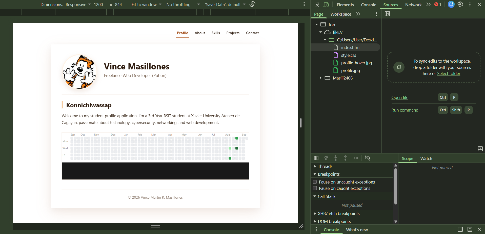
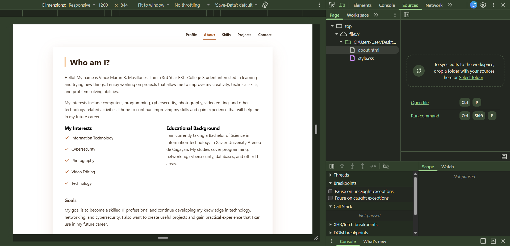
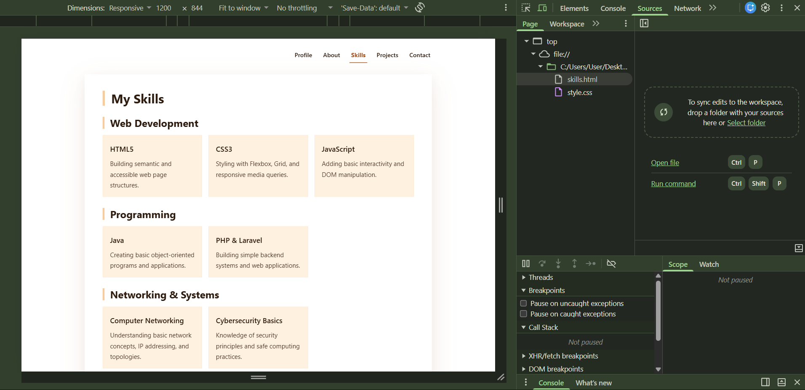
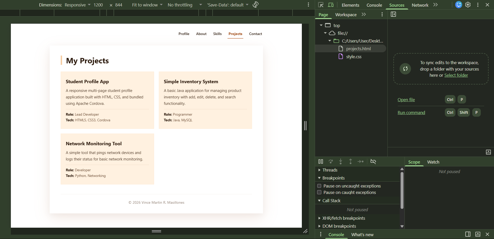
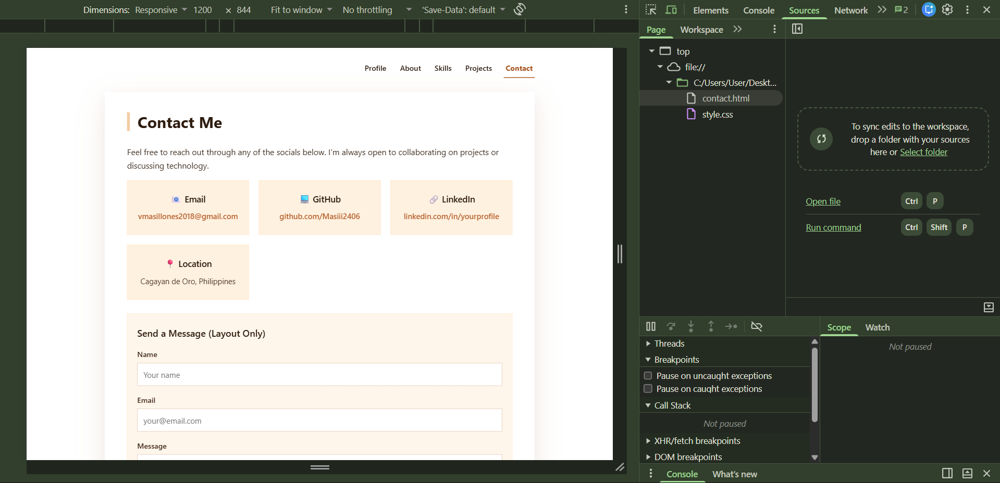
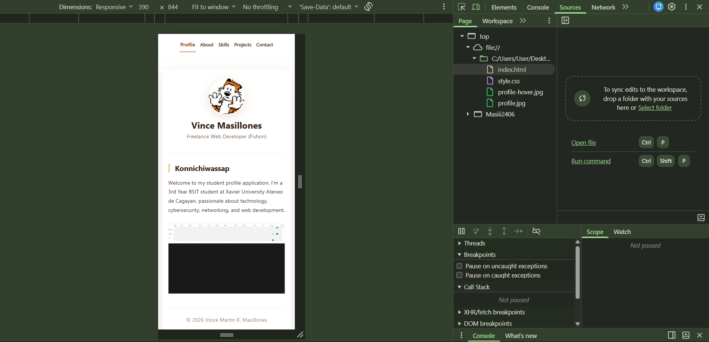
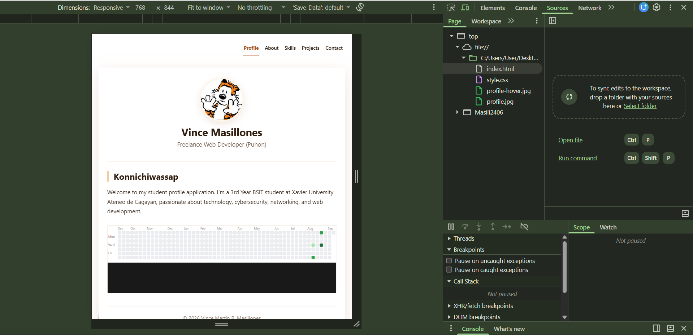

# Masillones_StudentProfile

A responsive **multi-page** Student Profile application built with HTML5, CSS3, and Apache Cordova.

## Project Description

This application expands the single-page Student Profile from Activity 3 into a full multi-page application. It has five pages, each with its own purpose and content, connected by a consistent navigation menu.

## Application Pages

| Page | File | Purpose |
|------|------|---------|
| **Profile** | `index.html` | Homepage with profile picture, name, tagline, brief intro, and live GitHub contribution graph |
| **About** | `about.html` | Personal intro, interests, educational background, and goals |
| **Skills** | `skills.html` | 8 skills organized by category with descriptions |
| **Projects** | `projects.html` | 3 projects with title, description, role, and technologies used |
| **Contact** | `contact.html` | Email, GitHub, LinkedIn, location, and contact form layout |

## Navigation

Navigation is implemented using **standard HTML links** — no JavaScript. Each page has the same navigation menu at the top with links to all five pages. The current page is highlighted with an underline.

Users can always return to the Profile homepage by clicking "Profile" in the navigation.

## Responsive Design

All five pages remain fully responsive using media queries:

- **Desktop (1200px+)**: Full layout, horizontal navigation
- **Tablet (768px)**: Centered content, adjusted spacing
- **Mobile (390px)**: Stacked layout, larger touch targets, single-column grids

## UI/UX Principles Applied

- **Consistency**: Same color palette, typography, navigation, and layout on every page
- **Visual Hierarchy**: Page titles, section headings, and body text are clearly distinguished
- **Usability**: Current page is highlighted; every page has a clear title and purpose
- **Readability**: Font sizes and line heights optimized for all screen sizes
- **Accessibility**: ARIA labels on navigation, meaningful alt text, focus states on links

## How to Run

### Option 1: In Browser
1. Navigate to the `www` folder
2. Open `index.html` in your browser

### Option 2: With Cordova

npm install -g cordova
cordova platform add android
cordova run android

## Application Screenshots

### Profile (Homepage)

### About

### Skills

### Projects

### Contact

### Responsive Design Proof

**Mobile (390px)**

**Tablet (768px)**

## Project Structure
├── www/
│ ├── index.html # Profile (Homepage)
│ ├── about.html # About page
│ ├── skills.html # Skills page
│ ├── projects.html # Projects page
│ ├── contact.html # Contact page
│ ├── style.css # Shared CSS
│ ├── profile.jpg
│ └── profile-hover.jpg
├── platforms/
│ └── android/
├── screenshots/
│ ├── profile.png
│ ├── about.png
│ ├── skills.png
│ ├── projects.png
│ ├── contact.png
│ ├── responsive-mobile.png
│ └── responsive-tablet.png
├── config.xml
└── package.json

## Activity Details

- **Course:** ITCC 41 — Mobile Application Development
- **Activity:** Module 4 — Multi-Page Student Profile
- **Student:** Vince Martin R. Masillones

## License

This project is for educational purposes only.

---

Created by Vince Martin R. Masillones