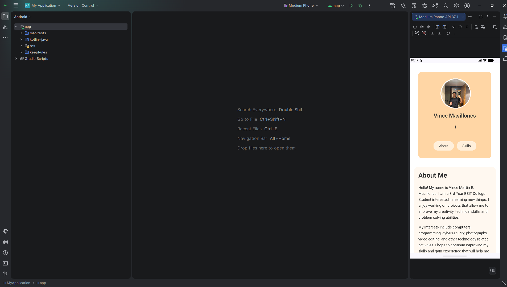

# Masillones_StudentProfile

A basic Student Profile page built with **HTML and CSS only**, bundled and compiled with **Apache Cordova**, and run on an Android emulator.

## Project Info

- **Course:** ITCC 41
- **Activity:** Activity 2 — Basic Student Profile
- **Student:** Vince Martin R. Masillones
- **Tech Stack:** HTML, CSS, Cordova (Android platform)

## Features

- Student profile card with photo, name, and quick-access buttons (About, Skills)
- CSS-based interaction (image hover swap on profile photo)
- Packaged as a Cordova Android app and tested on an Android emulator

## Screenshots



## Project Structure

```
Masillones_StudentProfile/
├── www/
│   ├── index.html
│   ├── style.css
│   ├── profile.jpg
│   └── profile-hover.jpg
├── platforms/
│   └── android/
├── screenshots/
│   └── app-screenshot.png
├── config.xml
└── package.json
```

## Running the Project

1. Install [Node.js](https://nodejs.org/) and Cordova CLI (`npm install -g cordova`)
2. Clone this repo
3. Run `cordova platform add android`
4. Run `cordova run android` (with an emulator running or a device connected)
